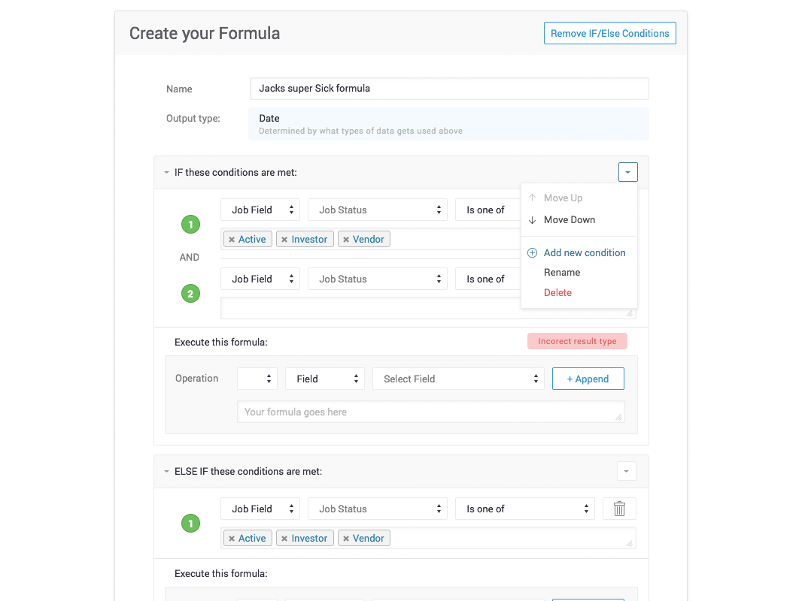
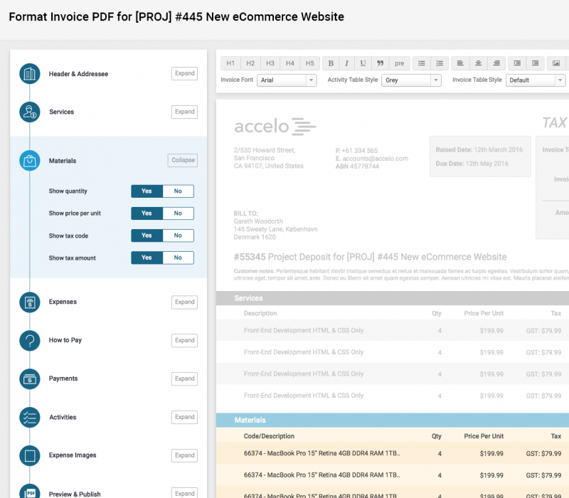

# Victor Chan

## Professional Summary
I am a web and mobile application developer with a strong history of self-driven learning and skills development. Because of this, I am able to function both as an individual and in a team.

As an individual, I am able to dig and explore existing code independently without much supervision to debug or extend any feature build as required. If I am dealing with legacy code, I am not afraid to ask questions or refactor codes such that the complexity can be abstracted away.

In a team environment, I am able to take a mockup or wireframe and efficiently plan, coordinate and join all moving parts together. My main aim in any feature build or product development is always to be able to build the foundation of the project in such a way that it supports asynchronous development. Each part should be stubbed at the start and developed in its own timeline with minimal time dependency on other parts.

## Stack
- Javascript
	- AngularJS
	- MongoDB
	- ES6 with Babel transpiler
	- Express
	- NodeJS
	- NPM
	- Grunt
- iOS
	- Xcode
	- Objective-C
	- Swift
- Design
	- Sketch
	- Balsamiq mockup
	- Invision
- HTML
- Perl
- MySQL
- Elastic Search

## Employment History

### Software Developer at Accelo Pty Ltd
- _07/2015 - Current_
- [Accelo](www.accelo.com) is a professional service application that helps small businesses and startups to manage their business administration. They handle things such as invoices, quotations, client relationship management, issues, project management, and many other aspects of running a business. They integrate with other services such as Quickbooks, Xero, Gmail, and Zapier.
- My role: iOS and Web full stack development, hiring and code reviews. I deal mostly with bug fixes, feature builds, and improving developer tools. My main initiatives in this company are starting a book club which led to the clean code movement in my company, implementing custom eslint plugins, and pushing for migration from npm to yarn. More description about these initiatives will be provided in the Projects and Initiatives Section.
- Stack used: Objective-C, HTML, AngularJS, NPM, Grunt, Perl, ElasticSearch, MongoDB, and MySQL.

### Software Developer at Delv Pty Ltd
- _02/2015 - 07/2015_
- [Delv](www.delv.com) is a mobile and infrastructure consulting firm that aids both private corporations and government departments to implement mobile device management (MDM) services for mobile devices issued to their employees. They also design and developed mobile applications for clients according to the required design and development specifications.
- My role: Prototype and develop iOS applications according to client specifications. This include building and managing MongoDB, API endpoints, and web interface for administering the database.
- Stack used: MongoDB, Express, Angular, NodeJS, and Swift

### Independent iOS Developer
- _2011 - 2015_
- My role: Prototype and design iOS application according to client specification. I would interview and gather the requirements and purpose of the application. After that, I would design a few wireframes and mockups for the clients to choose from. Then, I will usually start developing, and throughout the whole process, I will usually keep in touch with the clients to make sure that the communication and expectations are clear throughout the whole process.

## Education
- National University Of Singapore, Bachelor Of Computing
	- _08/2009 – 05/2013_
	- Graduated with Second Upper Honors

## Contact Info
- Phone: +61413827908
- Email: victor.z.chan@gmail.com
- Github: https://github.com/geekveek

## Projects and Initiatives

### In Accelo

#### Projects

##### Profitability and Utilization Dashboards

[Video Preview](https://www.accelo.com/resources/blog/utilization-and-profitability-sneak-peek-webinar/)

These profitability and utilization dashboards were built with AngularJS and D3. The backend data comes using Perl to handle the API request to get the data from a MySQL database. I built it such that it minimizes the number of requests required to build the graph during pagination by caching the Promise returned from the $http call. The requirements did not specify animations but it was my call to insert animation as it will provide orientation to the changes in data. Before this, we have been using Fusion Charts but we found that it was too heavy and inflexible for our use case. Because of this, now within our application, most places with graphs have been converted to D3 to lighten the download and this allows for more flexible animations.

##### Formula

Formula is a feature that I built to try to include some sort of customization to the values in custom fields. It runs through the formulas every time a change in the "if" condition happens and executes the formula accordingly. The challenge here was to ensure that the formulas worked with the current code, which used to only accept fixed values in those custom fields. Another challenge was to check for cyclical links, as values of the formulas can be used as part of a condition, and also type checking to make sure that the return value is of the expected type. It was implemented with AngularJS for frontend work with Perl retrieving data from MySQL on the backend.

##### Invoice

[Video Preview](https://www.accelo.com/resources/blog/new-invoicing-upgrade-now-live/)

Invoice was a massive task requiring different parts of the application to work together. I was in charged of producing the pdf preview and generating the pdf from the settings as provided by the user. These settings include turning on/off certain fields and changing the columns and contents of each section. I had to learn how to use wkhtmltopdf to generate the pdf and QT browser for debugging and generating a preview of the pdf for development. Also, I had to handle sanitization as the users are able to customize with HTML allocated sections of the invoice with a rich text editor (using textAngular).

#### Initiatives

##### Book Club (Leading To Clean Code Movement)
I have started a book club in Accelo in order to push for self-improvement and continuous learning through reading. I realize that many developers stagnate because they do not read, and I do not wish to see this in my fellow colleagues. In doing so, I started a Clean Code movement in my company, rising up to being one of the code reviewers and continuously providing feedback and motivation on making codes cleaner, and thus more readable. In doing so I've created a more pleasant environment to work in because developers do not have to waddle through dirty codes in order to extend a feature or fix a bug.

##### ESLint custom plugins
Before I came into Accelo, there was no form of linting of any kind. When I started the Clean Code movement in Accelo, we started by trying to draft and follow a style guide. This proves to be a tiresome endeavour as the list of styles kept on growing. We then decided to ditch the style guide and went on with using linters, with ESLint for Javascript linting. From then onwards, in order to create a custom style specific for our codebase, I wrote additional rules as plugins into ESLint. One of such rule is to prevent avoided functions from being used. Our particular set of functions is as shown below. I created it in such a way that it is easily extendable and educational at the same time. A few other rules include enforcing `parseInt()` to have the radix parameter. This is an old bug that may cause integers to be parsed as octal without the radix parameter.


"accelo/no-avoided-function": ["warn", {
	"avoidedFunctions": {
		"xdescribe": "jasmine.xdescribe() - We do not want skipped test to go into master",
		"xit": "jasmine.xit() - We do not want skipped test to go into master",
		"fdescribe": "jasmine.fdescribe() - This causes other tests not to be ran",
		"fit": "jasmine.fit() - This causes other tests not to be ran",
		"success": "$http.success() - Deprecated. Use then/catch pair instead",
	}
}],


##### Yarn
I pushed for the yarn migration over npm because of all the offline, asynchronous and speed benefits that yarn has over npm. The Accelo node dependencies were very much lagging behind, and I came up with a plan to migrate all developers iteratively without disrupting their workflow. I did this in a multi-step program which I checked off each step along the way. The steps are as listed below:
1. Increase the node version range to allow for 5.x.x to 6.x.x and get everyone updated. This is done by enforcing a node version check before any grunt task.
2. Get staging and Jenkins updated to node 6.x.x
3. Increase node version range to only allow 6.x.x
4. Update each node dependencies in batches.
5. Remove npm_shrinkwrap and only allow yarn installs from now onwards. This has to apply to any pre-install/post-install and pre-run and post-run grunt task and Jenkins.

##### Sublime Build Systems
I implemented build systems into Sublime and shared it with the rest of the team. Before these build systems existed, developers had to go into Terminal in order to run the grunt task to build or to restart Apache on their virtual machines. With the build systems in place, it saved developers time and attention as they do not need to switch context in the midst of coding.

### In Delv

#### Projects

##### [iCops](http://www.icops.com/)

The purpose of iCops was to sell it to the police departments in Australia to promote the use of mobile technology in the law enforcement industry. Features include arrest time tracking and handling in-processing procedures, push-to-talk, live video streaming from security cameras, and connecting with the community using a closed social media group.

I am the sole developer of iCops, which includes both the iPhone and Apple Watch App. During the development of iCops, we experimented with many technologies, including RTSP for live video streaming, iBeacon for indoor location tracking and push-to-talk.

#### Initiatives
In Delv, there were no ticket management systems or version control. I immediately dive in to start a Trello board to organize the features and sprints. I also pushed the company to use Bitbucket with Git as a version control tool and repository. As I was only one of the only two developers there, it was an overkill to use JIRA and Trello with Bitbucket issues management was enough for us. I also introduced the concept of code reviews to exchange information and help each other improve on our codes.

### Independent Works
In my free time, I like to improve myself, and I usually do that by going to meetups, joining online communities, and reading books. I usually attend ng-sydney and encourage many of my colleagues to attend in order to keep up-to-date with the latest trends in AngularJS. I have also read and supported to some open source book such as [Practical ES6](https://github.com/mjavascript/practical-es6) and [You Don't Know Javascript series](https://github.com/getify/You-Dont-Know-JS). I tend to explore new ideas and try to implement them in wherever I happen to be working in, such as introducing yarn and exploring using CasperJS for end-to-end testing.
